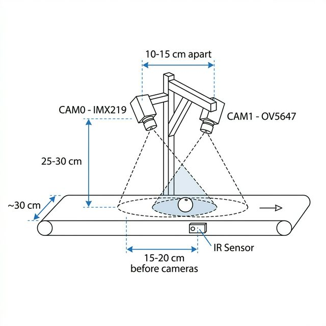
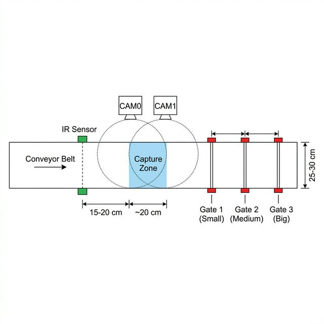

# Camera Placement Guide 📷

Optimal positioning of the dual cameras for accurate fruit size measurement.

---

## Side View — Mounting Dimensions



### Recommended Dimensions

| Dimension                     | Value        | Why                                                                 |
|-------------------------------|-------------|----------------------------------------------------------------------|
| **Camera height above belt**  | 25–30 cm     | Close enough for detail, far enough for full fruit in frame          |
| **Camera spacing**            | 10–15 cm     | Creates overlapping fields of view for dual-camera averaging         |
| **IR sensor → camera zone**   | 15–20 cm     | Gives the system time to detect the fruit before it enters the capture zone |
| **Camera tilt angle**         | 0–15° inward | Slight inward tilt maximises overlap on the belt center              |

### Key Rules

1. **Both cameras must see the entire belt width** (~25–30 cm) from their height.
2. **Keep the height consistent** — `PIXELS_PER_MM` calibration is only valid for a fixed distance.
3. **Avoid shadows** — mount an LED strip or diffused light alongside the cameras.
4. **Secure the mount** — any vibration changes the calibration.

---

## Top View — System Layout



### Component Spacing Along the Belt

```
Belt Direction ──────────────────────────────────────────►

  ┌──────────┐   ┌──────────────┐   ┌───────┐ ┌───────┐ ┌───────┐
  │ IR Sensor│   │ Capture Zone │   │Gate 1 │ │Gate 2 │ │Gate 3 │
  │          │   │  (cameras)   │   │ Small │ │Medium │ │  Big  │
  └──────────┘   └──────────────┘   └───────┘ └───────┘ └───────┘
       │              │                 │         │         │
       │◄─ 15-20 cm ─►│                 │         │         │
       │              │◄── ~20 cm ──►│  │         │         │
       │                                │◄─ proportional to relay delays ─►│
```

### Gate Positioning

Gate distances from the IR sensor are determined by the **conveyor belt speed** and the relay delays in `config.py`:

| Gate              | Relay Delay | Formula                            |
|-------------------|-----------|-----------------------------------------|
| Gate 1 (Small)    | 5 s       | `distance = belt_speed × 5 s`          |
| Gate 2 (Medium)   | 10 s      | `distance = belt_speed × 10 s`         |
| Gate 3 (Big)      | 15 s      | `distance = belt_speed × 15 s`         |

> **Example:** If your belt runs at 5 cm/s → Gate 1 at 25 cm, Gate 2 at 50 cm, Gate 3 at 75 cm from the IR sensor.

These delays can be adjusted in `config.py`:

```python
RELAY_DELAYS = {
    "small":  5,   # seconds
    "medium": 10,
    "big":    15,
}
```

---

## Camera Specifications

| Property        | CAM0 — IMX219 (8 MP) | CAM1 — OV5647 (5 MP) |
|-----------------|----------------------|----------------------|
| Resolution used | 1920 × 1080          | 1920 × 1080          |
| Field of view   | ~62°                 | ~54°                 |
| Connector       | CSI (CAM0 port)      | CSI (CAM1 port)      |
| Focus           | Adjustable ring      | Fixed / Adjustable   |

### Effective Coverage at Recommended Height

At **25 cm** height:

| Camera  | Horizontal coverage | Vertical coverage |
|---------|--------------------|--------------------|
| IMX219  | ~30 cm             | ~17 cm             |
| OV5647  | ~25 cm             | ~14 cm             |

At **30 cm** height:

| Camera  | Horizontal coverage | Vertical coverage |
|---------|--------------------|--------------------|
| IMX219  | ~36 cm             | ~20 cm             |
| OV5647  | ~30 cm             | ~17 cm             |

> **Tip:** 25 cm is the sweet spot — the belt is fully covered and pixels-per-mm resolution is high enough for accurate sizing.

---

## Mounting Options

### Option A: Aluminium Profile Frame (Recommended)

- Use 2020 or 2040 aluminium extrusion profiles.
- Attach cameras with adjustable ball-head mounts for fine-tuning angle.
- Secure the frame to the conveyor structure with L-brackets.

### Option B: 3D-Printed Bracket

- Print a bridge bracket that spans the belt.
- Include camera clip holders with tilt adjustment slots.
- Bolt the bracket to the belt frame.

### Option C: Acrylic / Wooden Stand

- Quick prototype option.
- Cut two vertical posts and a horizontal crossbar.
- Drill camera mounting holes at the correct spacing.

---

## Calibration After Mounting

After physically mounting the cameras, you **must** calibrate:

```bash
source venv/bin/activate
python calibrate.py
```

1. Place a ruler or credit card (known width) flat on the belt under the cameras.
2. Follow the prompts — the script writes `PIXELS_PER_MM` into `config.py`.
3. **Re-calibrate** any time you change the camera height or angle.

---

## Lighting Recommendations

| Setup               | Pros                          | Cons                          |
|---------------------|-------------------------------|-------------------------------|
| LED strip (diffused)| Even lighting, no harsh shadows | Needs 12 V supply            |
| Ring light on camera| Centred illumination          | Can cause glare on shiny fruit|
| Ambient room light  | No extra hardware             | Inconsistent, shadows likely  |

> **Best practice:** Mount a **warm-white LED strip** (3000–4000 K) parallel to the cameras, 5–10 cm away, with a frosted diffuser. This eliminates shadows and gives the best detection results.

---

## Checklist

- [ ] Cameras mounted 25–30 cm above belt surface
- [ ] Both cameras pointing downward (0–15° inward tilt)
- [ ] Camera spacing: 10–15 cm apart
- [ ] IR sensor placed 15–20 cm before the capture zone
- [ ] Full belt width visible in both camera feeds (check via monitor at `:8080`)
- [ ] Sorting gates positioned according to belt speed × relay delays
- [ ] Consistent lighting with no harsh shadows on the belt
- [ ] `python calibrate.py` run successfully after mounting
